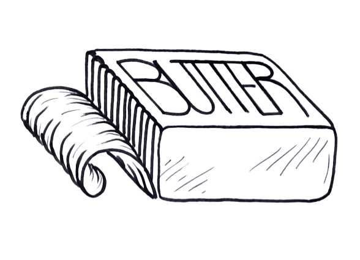

# 

> The network that spreads! 🧈


[](https://www.gnu.org/licenses/gpl-3.0)

## Abstract

Peer-to-peer (p2p) systems have some interesting properties in regard to scalability and dependability, due to their
decentralised nature. They address many of the pitfalls of centralised architectures such as cost of infrastructure and
single points of failure, resulting in fault-tolerant networks that can behave autonomously. Many of the current efforts
to design peer-to-peer systems use structured elements which improve the performance but re-introduce precariousness
present in centralised systems. Butter is a peer-to-peer (p2p) framework loosely inspired by other project such as
Gnutella, JXTA and libp2p, its goal is to explore what is achievable in unstructured p2p networks.

Each of the problems in building a p2p middleware corresponds to a module of the framework. Peer discovery is handled
by the `discover` package using a multicast protocol, the NAT traversal and wider internet peer discovery strategy is
handled by the `wider` package, an overlay network can be defined as per the `Overlay` interface and Butter implements
an overlay network to manage data that enables fault-tolerant information retention (persistence) and information
retrieval by introducing Peer Content Groups (PCG) and Random Breadth-first search mechanisms respectively.

A Butter node exhibits behaviours to discover new peers and manage known peers with a unique approach to known host
management optimising for diversity. Extra application specific functionality can be appended to peers by defining
server and client behaviours which are then registered to Butter nodes.

This project should facilitate the development of decentralised applications by abstracting away the distributed
behaviour from the developers and accommodate nodes with a whole variety of hardware.

- `butter` is *efficient* in the sense that it
    - maintains persistent data consistently (despite node failure and high churn) while trying to minimise data
      redundancy (low degree of duplicate data) - this makes concensus less of an issues than on other decentralised
      network designs
    - takes a space-efficient approach to creating and maintaining the list known hosts per node (by determining who are
      the 'best' remote hosts to know are on a node-by-node basis)
- `butter` is a *framework* in the sense that it provides tooling and utilities (in the form of a library packages and a
  standard atomic node) as well as documentation and examples for developing dapps

## Getting Started

### Preamble: communicating over the wider internet

The platform assumes a basic understanding of how to port forward (for home use). This is to deal with the pesky issue
of NAT traversal when listening out for incoming connections. Port forwarding is actually very simple but may seem
daunting at first, so, here is a good [guide](https://portforward.com/router.htm) on how to do it.

The library will either assign or expect the user to provide a port when creating a node. If that node needs to be
accessible outside the subnetwork it will be necessary to port forward from the router to the node's assigned/chosen
port.

It is worth noting that not every node needs to be forwarded to the wider internet, all it takes is one node on the LAN
to be accessible from the internet for the subnetwork to interact across the internet. However, having more public
facing nodes decreases the risk of the subnetwork being isolated from the wider Butter network.

### Installation

1. From within your Go project, run the following command:
   ```bash
   go get github.com/butter-network/butter
   ```
   This will download the library and configure your `go.mod` file.
2. Import the package into your project source:
   ```go
   package main
   import "github.com/butter-network/butter"
   ```

### Overlay networks

Butter is designed to be modular. It provides an inbuilt data overlay (implementation of the Overlay interface) to give
the network fault-tolerant information retention and retrieval abilities but if you wish to implement your own overlay
network that is possible too. You can implement your own version of the Overlay struct. For ease of use you can use the
default overlay network using the `butter.SpawnDefaultOverlay` function.

### Examples

Take a look the examples in the [examples/](./examples) directory.

To run one of the included examples, from the root of the project type:

```bash 
go run examples/[EXAMPLE_NAME]/main.go
(e.g. go run examples/ohce/main.go)
```

## Contributing

### What needs to be done?

- [x] Integrating Peer Content Groups storage logic, persist example and wiki into the main Butter repository
- [ ] Fix information retrieval (use IR from PCG)
- [ ] Implement heuristic based Information Retrieval
- [ ] Decouple Butter node from TCP protocol
- [ ] Implementing Gossip-based approach to Peer Content Group consensus in order to decrease message complexity
  maintaining groups
- [ ] Developing stress testing rig in order to detect how information persists at varying levels of churn
- [ ] Developing Information Retrieval test rig to test different retrieval algorithm speeds
- [ ] Cross network communication with some for of NAT traversal technique
- [ ] Looking at potential immutable datastructures built on top of Butter networks (e.g. blockchains)
- [ ] Possibly shifting codebase to Rust
- [ ] Updating documentation

### Development

- See the project board
- Raise an issue or pull request

**Project structure**:

Making a peer-to-peer system can be broken down into several sub-problems which are reflected in the package breakdown:

- Defining the core node behaviours (making the node behave as a peer by both acting as a server and client) and
  maintaining the network by managing known hosts is implemented in the `node/` package
- Peer discovery on the local network is implemented in the `discover/` package
- NAT traversal and peer discovery on the wider Internet is implemented in the `wider/` package
- A default overlay network for managing data on the Butter network is defined in the `dataOverlay/` package
  - Information persistence strategies are stored in the `persist/` directory (which contains an implementation of Peer 
    Content Groups which is a fault-tolerant (churn resilient) approach to information retention
  - Information retrieval strategies are stored in the `retrieve/` directory (which contains an implementation of Random
    Breadth-first search which is an efficient approach to information retrieval
- The `utils/` package contains some useful utilities for the project

### Testing

When testing on a development machine, it may become necessary to test the behaviour across several IP namespaces
(subnetworks), this can be achieved by running nodes in containers.

