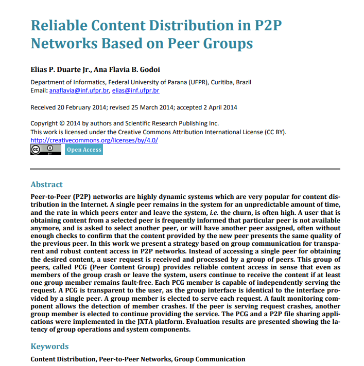

<!-- Don't say uhm! -->
<!-- Use speaker view (`s`) to keep track of things -->
<!-- Aim to do part 1 in 5min, part 2 in 10min and part 3 in 3min-->
<!-- Don't waffle be quick on each slide -->
<!-- Use chrome for presentation -->

<!-- .slide: data-background="white" -->


A decentralised application (dapp) framework

Note:
- I present to you...
- Culmination of a year work - I'm quite proud of it, and I have fallen in love with distributed and decentralised systems
- So, I'm excited to share that with you
- Project title was 'efficient decentralised network with case studies' - resulted in the creation of the framework
- Note, we have a nice logo - important for any good framework

---
## Outline

Note:
- Like any good story, our presentation is broken down into 3 parts...

---
<!-- .slide: style="text-align: left;" -->
### Part 1: An overview of the project 

- What is Butter?
- Related works
- Motivations
<!-- Review of the research & literature? -->
- Demo

---
<!-- .slide: style="text-align: left;" -->
### Part 2: Getting technical <!-- (technical content) -->

- Introducing the problems
- Butter's approach
  <!-- - The goal -->
  <!-- - Core design philosophies -->
  <!-- - Solutions -->

---
<!-- .slide: style="text-align: left;" -->
### Part 3: How we got here? <!-- (project management) -->

- The path
- Unforeseen problems
- What's to come...

Note:
- Some project management stuff...

---
## Part 1: An overview of the project

---
### What is Butter?

Butter is a networking stack and framework for building decentralised applications (dapps).

Note:
- What does that mean? 
- Butter is a collection of modular packages that can be pieced together to handle the networking behaviour of your decentralised application
- As a user, you append any extra functionality you want to a node, describe the processing you want it to do - the rest is handled by the framework
- At the end of the day, it allows the application service to be delivered, in a decentralised fashion, with minimum friction

---


Note:
- In the taxonomy of distributed systems, it lies here...
- Unstructured - each node is atomic and is indistinguishable from any other node
- Why unstructured vs structured?
  - Structured p2p more of an overhead when a node is joining and leaving the network, this is called bootstrapping (network figures out how to maintain its structure with the new node)
  - Less well adapted for a high churn rate (that is nodes frequently joining and leaving the network)
  <!-- - In addition, bootstrapping feels somewhat centralised, you need to know of another node before being able to join the network (libp2p) -->
- We'll see more of this in the persistent storage and information retrieval section of the presentation

---
<!-- .slide: style="text-align: left;" -->
### Related works

- [libp2p.io](https://libp2p.io/)
- [Gnutella](https://www.gnu.org/philosophy/gnutella.en.html)
- [BitTorrent](https://www.bittorrent.com/)

Note:
- (really only `libp2p` applies directly - because its is a framework)

---
### Motivations

- **Lack of confidence in cloud services**
- Fascinated by the idea of detaching information from infrastructure
- Interested in designing systems that reflect how people deal with information in the real world (i.e. **probabilistic** vs. deterministic)
- Finding a new way of interacting with information on the internet (new way of monetising)

Note:
- We navigate information as human probabilistically, I think there are some interesting lessons to be learnt from this

---
<!-- .slide: style="text-align: left;" -->
### Demo 1

The project GitHub page [github.com/a-shine/butter](https://github.com/a-shine/butter) has lots of examples

Note:
- Title was efficient decentralised network with case studies
- I chose to show you the wiki as I think it is a very pertinent example for a dapp
- In a wiki in which the information is community driven, it would make sense to have community hosted infrastructure 

---
### Demo 2 - Wiki dapp

Note:
1. Start node with browser interface
2. Start node with CLI interface
3. Have them side by side
4. Add information `<h1>Strawberries 🍓</h1>` to CLI
5. Retrieve on browser
   - Note that there is no central server here, the information isn't stored in a database
   - The 2 nodes have never been *explicitly* made aware of each other
   - Yet one node has been able to find information that was added by another node
   - This is all well and good, but it would be terrible if the information for strawberries was intrinsically tied to the CLI node
6. Kill CLI node
7. Retrieve on browser once more - data has persisted beyond the existence of the CLI node
8. Create a new CLI node
9. Kill browser node
10. Retrieve data once more
    - The two original nodes have died, yet the data persists - this is really cool!

---
## Part 2: Getting technical

---
### Introducing the problems

- **Peer discovery** (cold start problem)
- **Known host management**
- **Wider discovery (bridging subnetworks)**
- Persistent information
    - **Storage**
    - **Retrieval** (IR)

Note:
- The key problems when designing decentralised unstructured peer-to-peer architecture systems...
- How familiar are you with these problems? I am happy to explain them further if unfamiliar...
- Cold start - a cold start is when a node is first spawned, it is not aware of any other nodes and hence can't participate in the network
- Known host management - maintain a balance between known hosts so that the network is sufficiently connected to function, but nodes are not using too many resources maintaining their connections
- Wider discovery 
  - NAT traversal (i.e. how to be accessible publicly) - (Network Address Translation) traversal is a problem that occurs due to the limitations of IPv4 (not enough unique addresses), so we have subnetworks behind routers. We have to translate the addresses so that it is meaningful from one subnetwork to another
  - Finding public nodes to bridge subnetworks
- Persistent storage - how can we make information persist beyond a specific instance of a node?
- Information retrieval - how can we find information quickly and efficiently?

---
### Butter's approach

---
#### Solutions

| Problem               | Solution                      |
|-----------------------|-------------------------------|
| Discovery             | Multicast                     |
| Known host management | Known host quality cache      |
| Wider discovery       | Port forwarding & Ambassadors |
| Persistent storage    | PCG overlay                   |
| IR                    | Random TTL BFS                |

Note:
- Bearing these problems in mind (and the design philosophies) we can go about designing a framework to solve them

---
##### Discovery

```
PROCEDURE Ping:
  WHILE no known hosts:
    Send a ping message along a UDP multicast channel
    Pause for a response
    IF response THEN:
      Add remote node to list of known hosts
      BREAK
    ELSE
      Timeout
  END
```

```
PROCEDURE Listen:
  FOR:
    Listen for UDP packets in the multicast range
    IF packet THEN:
      IF ping:
        ADD them to your known hosts (if possible)
        Send a response containing your address
  END
```

Note:
- Multicast is group communication where data transmission is addressed to a group of destination computers simultaneously
- Now tends to be used over broadcasting as it floods the network less

---
##### Known host management 1

- Known host quality determined by: **uptime**, **available storage space** and **nb. of hosts known**
- Intuitively, we want to optimise for nodes with high uptime, lots of available storage that know lots of other nodes
- Edge cases
    - New node joining the network - how would they get themselves known?
    <!-- - e.g. If 3 nodes and all have max node capacity 1 -->

---
##### Known host management 2

SOLUTION: Optimise known hosts not for a specific kind of host but for a diverse distribution of host types

---
##### Known host management 3

- Trivially if you have enough memory to store a new node, and do not already know him, just store it (greedy philosophy)
- If you are at capacity, you can see whether the new node would make the list of known hosts more diverse
  - If it does, remove a host from the most popular class and store the new one 
  - Else, do nothing

Note:
- Reminiscent of the AI optimisation algorithms we learnt last year - known host list state, permutations either improves the state or not...

---
##### Wider discovery 1

- As a user, you can specify if you want your node to be an Ambassador (on the condition it is accessible publicly)
  - Appends an Ambassador flag to its host quality metric
  - Inbuilt behaviour to maintain a public index table of publicly available nodes that could bridge subnetworks 
  <!-- - find nodes on separate subnetworks and introduce them -->

Note:
- For NAT traversal i.e. how to become publicly accessible behind a router
- Solution: I am operating on the assumption that users will have to port forward to be publicly available (not be hidden behind NAT)
- Still have problem of finding other peers on the wider internet - can't just multicast!
- Current approach's still require some form of centralised index - ambassadors

---
##### Persistent storage 1




Note:
- I started by looking at the classic approach used in most p2p projects - Chord and Kademlia DHTs - structured networks for persistent information
- But these have lookup tables, super-peers or Distributed Hash Tables. These are introduced primarily to improve network performance by reducing message complexity. However, this then reintroduces some primary pitfalls of the centralised client-server model e.g. DHTs a known bootstrap node, BitTorrent requires super-peers (it calls trackers) that have lockup tables - that sounds fairly centralised to me
- Therefor I knew I wanted to implement an entirely unstructured P2P network
- I found 2 papers that gave me an idea - I didn't necessarily implement them but rather based my implementation on them

---
##### Persistent storage 2

- Fairly trivial when there is no node/link failure - just introduce a graceful exit procedure for nodes leaving the network (offload the information to their known hosts)
- But how do you deal with the possibility of node failure/link failure (specially relevant on high churn networks)? - redundancy
- If you introduce redundancy, how do you efficiently manage redundant information?

Note:
- This is where the "Reliable content distribution based on peer groups" paper was really helpful

---
##### Persistent storage 3

Introducing: **PCG (Peer Content Group) overlay**

Note:
- Way to reason about information more specifically duplicate/redundant information on the network through Groups

---
##### Persistent storage 4

- When a new piece of information is added to the network, a group is created
- Group is responsible for maintaining this information
- A group maintains itself through regular heartbeats
- Groups actively try to 'spread' (like butter) their information to hosts (hence the name of framework)

Note:
- Group maintaining information by electing a leader to find other members to join the group (if it deems it necessary to find new members) - you'll see this in the next slide
- Leader election is fairly trivial as each group participant has a consistent view of the group (updated with heartbeats)
- Heartbeat message complexity could be improved by using gossiping - will be implemented as a future development of the framework

---
##### Information retrieval 1


*Credit: Demetrios Zeinalipour-Yazti, Dimitrios Gunopulos*

Note:
- In an unstructured network, information retrieval is really quite tricky
- Really, deterministically, it is difficult to find a solution but to BFS through the network
- However, we can make some significant improvements if we use probabilistic techniques
- This diagram is taken from a paper comparing different IR techniques on unstructured peer-to-peer networks

---
<!-- .slide: style="text-align: left;" -->
##### Information retrieval 2

Improving on the BFS approach
- Prevent excess flooding of the network by adding a TTL (Time To Live) to each query
- Random-BFS (select a random subset of known hosts to query)

Note:
- The advantage of RBFS is that it does not require global knowledge; a node is able to make local decisions in a fast manner since it only needs to select a portion of its peers.
- On the other hand, this algorithm is probabilistic - some large segments of the network may become unreachable because a node was not able to understand that a particular link would lead the query to a large segment of the network

---
##### Information retrieval 3


*Credit: Demetrios Zeinalipour-Yazti, Dimitrios Gunopulos*

Note:
- Here we are looking at only half of peers at random 
- Decreases the avg nb of generated message per query by a factor of 5
- Yet we can still retrieve the document just under 60% of the time

---
## Part 3: How we got here

---
### The path

Incremental software development methodology

Note:
- Started with an intention of being quite Agile but in practice was more of an incremental approach - as I read the literature and become more familiar with a problem, I implemented a solution
- Incremental Model is a process of software development where requirements are broken down into multiple standalone modules of software development cycle. Incremental development is done in steps from analysis design, implementation, testing/verification, maintenance.

---
#### Summer 2021
Started learning about blockchains, IPFS, libp2p, Chord and Kademlia DHTs

---
#### Term 1
- Getting to grip with distributed (decentralised) systems
- Learning about Rust and systems/network programming
- Reading academic literature on Information Retrieval in unstructured architectures
- Completion of the Discovery and Wider discovery packages
- Implementation of trivial Known host management, and Persistent storage packages

Note:
- The obvious challenge with this project is it is impossible to do anything until you have at least a trivial 
implementation of all the necessary components
- Challenge of a distributed system's project is that the system only really works when you have all the components

---
#### Christmas break
- Implementation of IR using BFS
- Switch from Rust to Go
- Starting to write up project documentation

---
#### Term 2
- Reading literature on persistence storage on high churn unstructured p2p systems
- Implementation of intelligent known host management optimising for diversity
- Implementation of persistent storage based on PCG overlay

---
Throughout weekly meetings with Adam

Note:
who's been really helpful and supportive throughout

---
### Unforeseen problems

Note:
- There were 2 key project management decisions that I struggled with
- The two major turning points in the project

---
#### Problem 1

- Development was taking too long
- Rust does not yet support easy asynchronous programming
- Poor tooling (IDE support)

**Solution**: Switch from Rust to Go

Note:
- By the nature of the project, I had to implement everything at least trivially to start testing and debugging system...
- While Rust is a great language, it is still a little immature - the tooling is not great yet (just makes debugging a 
bit harder), the Ownership semantics are quite unique and difficult to get to grip with
- So will Rust is very performant and lightweight, it was not the right language for this project at least in the 
context of the limited timeframe and also my limitations (I couldn't learn about systems, network, distributed 
programming as well as a very different language)

---
#### Problem 2

- Poor quality of papers in peer-to-peer systems
    - Lack of consistent terminology
    - Too many assumptions
- Lack of papers on unstructured peer-to-peer architectures

Note:
- This is a criticism that Tanenbaum raises in his distributed systems textbook
- No real solution but added an extra challenge

---
### What's to come...

- Continued development of the project
- Focus on building a testing framework for peer-to-peer systems in Go
- Reviewed scepticism of libp2p
- Integrate a Butter with a browser - idea that as you use the internet you contribute resources to it
- Possibility of collaborating on a paper with Adam - summative review + formalisation of PCG and Known Host Management techniques

Note:
- Having been sceptical of libp2p, I have a much better appreciation for its design, I would like to contribute to it

---
### Butter vs. libp2p


Note:
- My initial view was I wanted to steer clear from libp2p
- As I made progress, my framework started to feel more and more like libp2p
- Modularity is definitely inspired by libp2p
- Several implementations of transport, discovery, peer routing and content routing to chose from

---
## Acknowledgements

- Adam (of course)
- libp2p project

Note:
- Adam - helpful and support + I've really liked the fact that we've had lots of interaction
- libp2p
  - providing high quality resources
  - effort to improve the overall field of peer-to-peer systems

<!-- Extra-stuff for completeness -->

---
#### Goal

Efficient and decentralised while not compromising information availability

Note:
- Reminiscent of the project's title 'efficient decentralised' as well as the motivations
- As I improved my knowledge of distributed systems I started to think of Butter through the lens of dependability and fault-tolerance

---
<!-- .slide: style="text-align: left;" -->
#### Core design philosophies

- Simplicity
- Modularity
- Memory greedy
- Avoid panicking (fault-tolerant approach - manage faulty states)
- Diversity

Note:
- First lets consider the way Butter was designed (determine how we solve the problems) and how the philosophies align with the goal
- Simplicity - needs to make building dapps easy and feel similar to existing backend web frameworks
- Modularity - you can pick and choose which aspects of the framework you want and re-implement others
- Memory greedy - use as much memory as you have been allowed to use
- Avoid panicking - avoid nodes failing and shutting down - a node in a faulty state is still more valuable to the network than no node at all (fault-tolerant as apposed to fail-safe approach)
- Diversity - accommodate all types of nodes (flexible to different resources)

---
<!-- .slide: style="text-align: left;" -->
#### A node's journey

e.g. reverse echo dapp
```go
package main
import (
    "fmt"
	"github.com/a-shine/butter"
    "github.com/a-shine/butter/node"
	"github.com/a-shine/butter/utils"
)

// DummyOverlay implements Overlay
type DummyOverlay struct {
	node *node.Node
	// any other fields...
}

func rEchoMsg(msg []byte) []byte {
	return reverse(m)
}

func sendMsg(super node.Overlay) {
	// User input message...
	for host := range super.Node().KnownHosts() {
		// Send message
		response := utils.Request(host, "recho-message/", inputMsg)
        fmt.Println(response)
    }
}

func main() {
	// Create a Butter node
    butterNode, err := node.NewNode(0, 512)
	
    // Specifying app level behaviours
    butterNode.RegisterServerBehaviour("recho-message/", rEchoMsg)
    butterNode.RegisterClientBehaviour(sendMsg)

    // Spawn node into the Butter network
    butter.Spawn(&DummyOverlay{node: butterNode}, false) // Blocking
}
```

Note:
- Explain from the main function down
  1. first a node is created (define a port and allocate memory the node can use)
  2. Associate the app specific behaviours with the node e.g. if a node receives a request to recho-message, it will reverse the message and return it
  3. Define a high level node, termed overlay node which gives the developer the ability to add extra functionality to a node
  4. Spawn the node into the butter network
  5. Launches the startup sequence (peer discovery)
  6. Node learns bout the network to form its partial view
  7. Node starts listening and handling requests and interacts with the rest of the network

---
##### Persistent storage extra 1

- By default, groups try and maintain information across 3 participants
- If the information is deemed important by the network i.e. frequently queried (as determined by the group)
- Then the group seeks to maintain the information across more participants
- This has the added benefit of increasing the performance of information retrieval (higher probability of encountering a node that contains the information you are looking for)

---
##### Persistent storage extra 2 - tests

| Chance to fail | % Groups maintained |
|----------------|---------------------|
| 1 in 20        | 30                  |
| 1 in 200       | 70                  |
| 1 in 500       | 100                 |

Carried out on 1000 nodes in a high churn simulated environment

---
<!-- .slide: style="text-align: left;" -->
##### Persistent storage extra 3
A group can be in one of three states
- **Cold** - not enough members to ensure that the information is available (high probability of information loss)
- **Goldilocks** - enough members to ensure that the information is available (low probability of information loss)
- **Hot** - too many members (no effect on availability but rather to efficiently managing the group in terms of time, storage, message complexity)

Note:
- The hot state is usually as a result of subnetworks merging

---
##### Information retrieval extra 1 - explaining BFS

- A node $i$ generates a $query$ message which is propagated to all of its neighbors (known hosts)
- When a node $j$ receives a $query$ request, it first checks in its local repository if it has the information being queried
  - If it does, it returns the information with a $queryHit$ message
  - Else, it returns a list of its own known hosts to node $i$
- Node $i$ stops querying the network if it received the returned information from node $j$ and a $queryHit$, or it adds the known hosts of node $j$ to his queue

Note:
- Keep a cash of the nodes you've visited (so don't create cycles in the graph search)


---
<!-- .slide: style="text-align: left;" -->
##### Information retrieval extra 2 - Chunking
- When information is added, a hash of that information is created, and it is broken down into 4kb chunks
- An id for information is generated via the hash and nb. of chunks
- When you query the network you attempt to find any node that is holding the hash of the information regardless of the specific chunk
- Once you have intercepted a first chuck you are aware of all the other chucks (as the nb of chunks is stored as metadata in the chunk)
- So you can query for the remaining data in parallel

---
##### Information retrieval extra 3

```pseudocode
PROCEDURE QueryNetwork(infoId):
  IF infoId is stored locally:
    RETURN localStorage[infoId]
  ELSE:
    TRY:
      RBFS(infoId, TTL)
    ELSE:
      BFS(infoId, TTL)
  END
```
