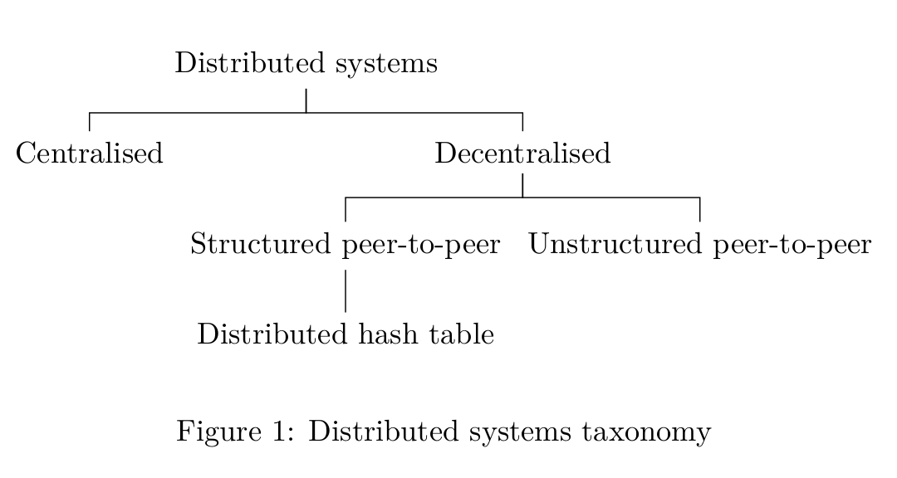

# Butter

A decentralised application framework

---
<!-- .slide: data-background="white" -->


Note: We have a nice logo!

---

## Outline

- An overview of the project
    - What is Butter?
    - Motivations
    - Related projects
    <!-- Review of the research & literature? -->
    - Demo
- Getting technical
    - Introducing the problems
    - Butter's approach
        - Core design philosophies
        - Solutions
- How we got here?
    - The path
    - Unforeseen problems
    - What's to come...

Note:
The presentation is broken down into 3 parts In the related projects do a comparison with libp2p In the demo, run
through building an echo/chat dapp and then demo the fancy wiki dapp

---

## Part 1: Overview

---

### What is Butter?

Butter is a networking stack and framework for building decentralised applications (dapps).

Note:
What does that mean?... What makes it a framework is because it is composed of a collection of modular packages that you
can piece together to handle the networking behaviour of your application You simply define your overlay network (or use
the default one) and describe the processing you want the nodes of your application to do, the rest is handled by the
framework

---


Note:
In the taxonomy of distributed systems, it lies here... Why unstructured p2p?...

---

### Motivations

- Lack of confidence in cloud services
- Fascinated by the idea of detaching information from infrastructure
- Interested in designing systems that reflect how people deal with information in the real world (i.e. probabilistic
  vs. deterministic)

---

### Related projects

- [libp2p.io](https://libp2p.io/)
- [Gnutella](https://www.gnu.org/philosophy/gnutella.en.html)
- [BitTorrent](https://www.bittorrent.com/)

*(really only libp2p applies directly)

---

### Demo

- Building an echo dapp from scratch
- Wiki dapp

The project GitHub page [github.com/a-shine/butter.com](https://github.com/a-shine/butter) includes examples to look at too!

Note:
Here's one I made earlier...

---

## Part 2: Getting technical

---

### Introducing the problems

- Peer discovery (cold start problem)
- NAT traversal
- Known host management (allowing everyone to contribute while still maintaining functionality)
- Overlay network for persistent information
    - Fault-tolerant storage (high availability)
    - Information retrieval

Note:
The key problems when designing decentralised unstructured peer-to-peer architecture systems...

---

### Butter's approach

---

#### Core design philosophies

- **Simplicity** (needs to make building dapps easy and feel similar to existing backend web frameworks)
- **Modularity** (you can pick and choose which aspects of the framework you want and re-implement others)
- **Memory greedy** - use as much memory as you have been allowed to use - might as well use it
- **Never panic** - it's a fault-tolerant system to maximise availability, we should avoid nodes failing at all costs
  cause a node in a faulty state is still more valuable to the network than no node at all
- **Diversity** - increase probability of information availability and faster retrieval

Note:
First lets consider the way Butter was designed (this will determine how we solve the problems)

---

#### Solutions

| Problem          | Butter's solution         |
| -------------------- |---------------------------|
| Discovery            | Multicast                 |
| NAT Traversal        | (Imperfect) Ambassador nodes |
| Known host management | Known host quality cache  |
| Persistent storage   | PCG overlay               |
| IR                   | Directed BFS              |

Note:
Bearing these problems in mind (and the design philisphies) we can go about designing a framework to solve them

---

##### Discovery

```pseudocode
Procedure Ping:
  For:
    Send a ping message along a UDP multicast channel
    Wait for a response
    If response:
      Add peer to known peers
    break
  End
```

```pseudocode
Procedure Listen:
  For:
    listen for UDP packets in the multicast range
    If packet:
      If ping:
        Send a response with your node listner socket address
  End
```

---

##### NAT Traversal

Note:
Brush over this...

---

##### Known host management 1

- Known host quality determined by: uptime, available memory for stirage and nb of hosts known
- Intuiatively - we want to optimise for nodes with high uptime, lots of available storage that know lots of other nodes
  BUT!
- Diversity
- Edge cases
    - new node joining the network
    - if 3 nodes and all have max node capacity 1

---

##### Known host management 2

- Trivually if you have enough memory to store a new node, just store it (greedy philosophy)
- If you are at capacity, you can see whether or not the new node would make the list of known hosts more diverse

---

##### Persistent storage 1

- PCG overlay

Note:
Based on a paper by... Needed a way to reason about information more specifically duplicate/redundant information on the
network - groups

---

##### Persistent storage 2

---

##### Persistent storage 3

---

##### Information retrieval

```pseudocode

```

---

## Part 3: How we got here

---

### The path

- Summer 2021 - learning about blockchains, IPFS and libp2p
- Term 1
    - Getting to grip with distributed systems, specifically decentralised (peer-to-peer architecture) systems
    - Learning about Rust and systems/network programming
    - Reading academic literature on Information Retrieval in unstrucrured distributed architectures
    - Completion of the Discovery and NAT Traversal packages
    - Implemenation of trivial Known host management, and Persistent storage packages
- Christmas break
    - Lots more academic literature on IR in distributed systems
    - Implementation of IR using BFS
    - Switch from Rust to Go
    - Starting to write up project documentation
- Term 2
    - Reading literature on fault-tolerance
    - Shift in focus as the we start to look at project from a fault-tolerance perspective
    - Reading literature on persistence storage on high churn unstrucrured p2p systems
    - Implementation of inteligent known host management optimising for diversity
    - Implementation of persistent storage based on PCG overlay
    - Preparing presentation

Throughout weekly meetings with Adam, who's been really helpful and supportive (as well as challenging might I add)

---

### Unforeseen problems

- Development was taking too long
- Not as well suited to asynchronous programming 

Solution: switch from Rust to Go

- Poor quality of papers in peer-to-peer systems
    - Lack of consistent terminology
    - Assumptions
- Lack of papers on unstructured peer-to-peer

Solution: There was an added challenge to the project in formalising a lot
  of the terminology and coming up with new creative solution and protocols to the problems

Note:
<!--Add project management story I.e. found progress to be very slow in rust and wasn’t the right tool for the job so made the decision to switch to go and project improved-->

---

### What's to come...

- Continued development of the project
- Focus on building a testing framework for peer-to-peer systems in Go
- Reeviewed sceptisism of libp2p

Note:
Having been sceptocal of libp2p, I have a much better appreciation for it's design, I would like to contribute to it
hopefully working towards a more unstrucrured architecrural design

---

## Acknowledgements

- Adam (of course)
- libp2p project
- Tennanbaum book on distributed systems