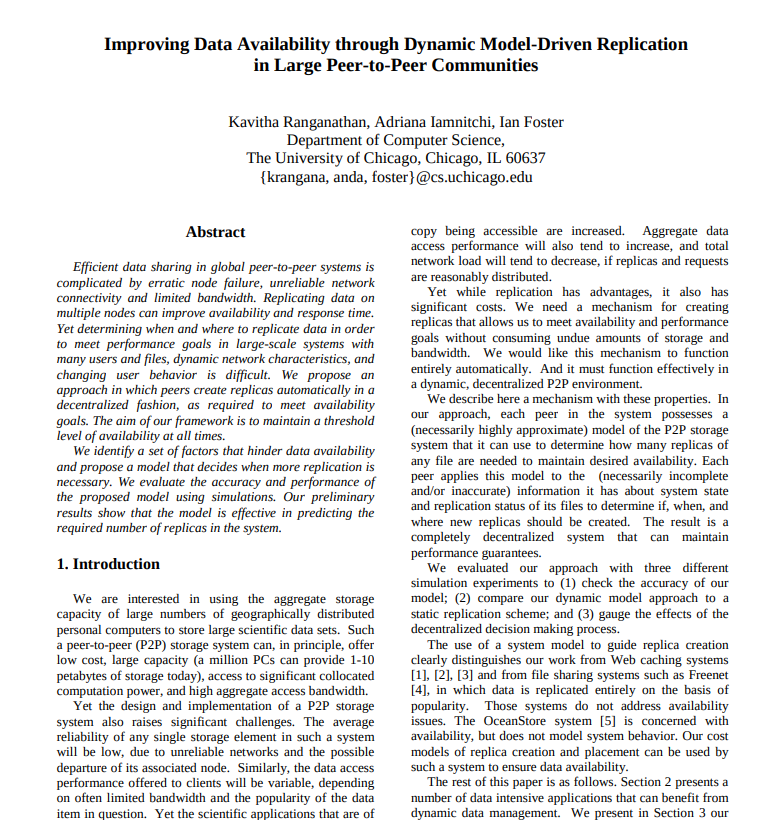

# Butter

A decentralised application (dapp) framework

Note:
The project title was 'efficient decentralised network with case studies' - and this resulted in Butter

---
<!-- .slide: data-background="white" -->


Note:
First and foremost, we have a nice logo - extremely important for any framework :)

---
## Outline

Note:
The presentation is broken down into 3 parts...

---
<!-- .slide: style="text-align: left;" -->
### Part 1: An overview of the project 

- What is Butter?
- Motivations
- Related works
<!-- Review of the research & literature? -->
- Demo

Note:
In the demo, run through building an echo/chat dapp and then demo the fancy wiki dapp

---
<!-- .slide: style="text-align: left;" -->
### Part 2: Getting technical <!-- (technical content) -->

- Introducing the problems
- Butter's approach
    - Core design philosophies
    - Solutions

---
<!-- .slide: style="text-align: left;" -->
### Part 3: How we got here? <!-- (project management) -->

- The path
- Unforeseen problems
- What's to come...

---
## Part 1: An overview of the project

---
### What is Butter?

Butter is a networking stack and framework for building decentralised applications (dapps).

Note:
What does that mean?... 
What makes it a framework is because it is composed of a collection of modular packages that you
can piece together to handle the networking behaviour of your application
You simply define your overlay network (or use the default one) and describe the processing you want the nodes of your 
application to do, the rest is handled by the framework

---


Note:
In the taxonomy of distributed systems, it lies here... Why unstructured p2p?... We'll see when we get to the 
persistent storage overlay design...

---
### Motivations

- Lack of confidence in cloud services
- Fascinated by the idea of detaching information from infrastructure
- Interested in designing systems that reflect how people deal with information in the real world (i.e. probabilistic
  vs. deterministic)
- Finding a new way of interacting with information on the internet (new way of monetising)

---
<!-- .slide: style="text-align: left;" -->
### Related works

- [libp2p.io](https://libp2p.io/)
- [Gnutella](https://www.gnu.org/philosophy/gnutella.en.html)
- [BitTorrent](https://www.bittorrent.com/)

*(really only libp2p applies directly)
Note:
While Gnutella and BitTorrent are both decentralised peer-to-peer systems, they are the system as opposed to the 
framework
They have way less functionality and are fit for one purpose

---
<!-- .slide: style="text-align: left;" -->
### Demo

- Building an echo dapp from scratch
- Wiki dapp

The project GitHub page [github.com/a-shine/butter](https://github.com/a-shine/butter) includes examples too

Note:
Here's one I made earlier...

---
## Part 2: Getting technical

---
### Introducing the problems

- **Peer discovery** (cold start problem)
- **NAT traversal** (not really a focus currently)
- **Known host management** (allowing everyone to contribute while still maintaining functionality)
- Overlay network for persistent information
    - Fault-tolerant **storage** (high availability)
    - **Information retrieval** (IR)

Note:
The key problems when designing decentralised unstructured peer-to-peer architecture systems...

---
### Butter's approach

---
#### Goal

Efficient and decentralised while not compromising availability

Note:
Reminiscent of the project's title 'efficient decentralised' as well as the motivations
As I improved my knowledge of distributed systems I started to think about the butter through the lens of fault-tolerance

---
#### Core design philosophies

<!-- .slide: style="text-align: left;" -->
- Simplicity
- Modularity
- Memory greedy
- Never panic (fault-tolerant)
- Diversity

Note:
First lets consider the way Butter was designed (this will determine how we solve the problems) and how the philosophies align with the goal
Since exploring the academia of distributed systems and fault-tolerance, I think the best way of looking at project is through the lens of fault-tolerant distributed systems particularly in regard to the availability dependability attribute
- Simplicity - needs to make building dapps easy and feel similar to existing backend web frameworks
- Modularity - you can pick and choose which aspects of the framework you want and re-implement others
- Memory greedy - use as much memory as you have been allowed to use - might as well use it
- Never panic - it's a fault-tolerant system to maximise availability, we should avoid nodes failing at all costs
  cause a node in a faulty state is still more valuable to the network than no node at all
- Diversity - Known host diversity (increase probability of information availability and faster retrieval) + spread load 
  across all types of nodes

---
#### Solutions

| Problem               | Butter's solution            |
|-----------------------|------------------------------|
| Discovery             | Multicast                    |
| NAT Traversal         | (Imperfect) Ambassador nodes |
| Known host management | Known host quality cache     |
| Persistent storage    | PCG overlay                  |
| IR                    | BFS (directed in future)     |

Note:
Bearing these problems in mind (and the design philosophies) we can go about designing a framework to solve them

---
##### Discovery

```pseudocode
PROCEDURE Ping:
  FOR:
    Send a ping message along a UDP multicast channel
    Wait for a response
    IF response THEN:
      Add remote node to known hosts
      BREAK
    ELSE
      Timeout
  END
```

```pseudocode
PROCEDURE Listen:
  FOR:
    Listen for UDP packets in the multicast range
    IF packet THEN:
      IF ping:
        ADD them to your known hosts (if possible)
        Send a response containing your address
  END
```

---
##### NAT Traversal 1

- No real decentralised solution for NAT traversal
- Why is NAT a thing? - IPv4

Note:
Could do hole-punching
Best current approach is to use a boostrap DHT node (libp2p) but that requires some for of centralisation
What did I come up with...

---
##### NAT Traversal 2

- As a user, you can specify if you want your node to be an Ambassador (on the condition it is accessible publicly)
- If it is an Ambassador, he appends an Ambassador flag to his host quality metric
- As an Ambassador, the node has an inbuilt behaviour to store a list of nodes that want to bridge subnetworks
- His job is to find two nodes on separate subnetworks and introduce them

Note:
Brush over this...

---
##### Known host management 1

- Known host quality determined by: uptime, available storage and nb. of hosts known
- Intuitively, we want to optimise for nodes with high uptime, lots of available storage that know lots of other nodes
- Edge cases
    - New node joining the network - how would they get themselves known?
    - e.g. If 3 nodes and all have max node capacity 1

---
##### Known host management 2
SOLUTION: Optimise known hosts not for a specific kind of host but for a diverse distribution of host types

---
##### Known host management 3

- Trivially if you have enough memory to store a new node, and do not already know him, just store it (greedy philosophy)
- If you are at capacity, you can see whether the new node would make the list of known hosts more diverse
  - If it does, remove a host from the most popular class and store the new one 
  - Else, do nothing

---
##### Persistent storage 1




Note:
- I actually felt quite disillusioned with the notion of decentralised systems when I was reading the literature...
- I read the classic papers on the topic: Chord and Kadmelia as well as lots of the summative reviews a notably a big review by cambridge on overlay networks from 2005 (https://www.cl.cam.ac.uk/research/dtg/www/files/publications/public/mp431/ieee-survey.pdf)
- Remained really unsatisfied with their approach - and I'd argue any system that claims to be fully decentralised and uses a structured overlay architecture is not truly decentralised
- Despite the benefits of a decentralised approach, the majority of popular P2P networks include structured elements such
as lookup tables, super-peers or Distributed Hash Tables. These are introduced primarily to improve network
performance by reducing message complexity. However, this then reintroduces some primary pitfalls of the client-server
model e.g. DHTs a known bootstrap node, BitTorent requires super-peers (it calls trackers) that have lockup tables - that sounds fairly centralised to me
- Therefor I knew I needed to implement an entirely unstructured P2P network which would be a better design for information availability and fault tolerance because there is no central point of failure and it is difficult to control or censor information on the network - this fulfils my main motivation 
- I really struggled to find solutions that didn't suffer from these limitations - there is not that much literature on unstructured p2p architectures
- After digging the depth of the internet, I found 2 papers that gave me an idea - I didn't necessarily implement them but rather based my implementation on them

---
##### Persistent storage 2

- Introducing the **PCG** (Peer Content Group) overlay
- Based on the Reliable Content Distribution in P2p networks based on peer groups paper (seen on the previous slide) I had a way to reason about information more specifically duplicate/redundant information on the network - groups
- At the end of the day, percistency is fairly trivial on when there is no node failure/link failure - just introduce a graceful exit procedure for nodes leaving the network (where they offload the information they host to their known hosts)
- But how do you deal with the possibility of node failure/link failure (specially relevant on high churn networks)? - redundancy
- But if you introduce redundancy you need to find ways of efficiently managing redundant information - this is where the paper was really helpful

---
##### Persistent storage 3

- So when a new piece of information is added to the network, a group is created
- The group is responsible for maintaining this information (trivial leader election as each group participant has a full view of the group updated with heartbeats)
- A group can be in 3 states
  - **Cold** - not enough members to ensure that the information is always available (high risk of information loss)
  - **Goldilocks** - enough members to ensure that the information is always available (low risk of information loss)
  - **Hot** - too many members (usually as a result of subnetworks merging) does not pose a risk to availability but rather to efficiently managing the group (time, storage, message complexity)
- A group maintains itself through regular heartbeats
- 'Butter' approach to information where groups actively try to spread there information to hosts if they are in a cold state (hence the name of framework)

---
##### Persistent storage 4

- By default, groups try and maintain information across 3 participants
- But if the information is deemed important by the network i.e. if information is frequently queried (as determined by the group)
- Then the group seeks to maintain the information across more participants
- This has the added benefit of increasing the performance of information retrieval (higher probability of encountering a node that contains the information you are looking for)

---
##### Information retrieval 1
- When information is added, a hash of that information is created and it is broken down into 4kb chunks
- An id for information is generated via the hash a nb. of chunks
- When you query the network you attempt to find any node that is holding the hash of the information regardless of the specific chunk
- Once you have intercepted a first chuck you are aware of all the other chucks (as the nb of chunks is stored as metadata in the chunk)
- So you can query for the remaining data in parallel

---
##### Information retrieval 2

```pseudocode
PROCEDURE QueryNetwork(infoId):
  IF infoId in Self:
    RETURN Self[infoId]
  ELSE:
    BFS
```

```pseudocode
PROCEDURE BFS(infoId):
  QUEUE = [Self]
  VISITED = []
  WHILE QUEUE != []:
    NODE = QUEUE.pop()
    IF NODE[infoId] != None:
      RETURN NODE[infoId]
    ELSE:
      FOR NODE in NODE.neighbors:
        IF NODE not in VISITED:
          QUEUE.append(NODE)
          VISITED.append(NODE)
  RETURN None
```

Note:
When querying information...

---
## Part 3: How we got here

---
### The path

---
#### Summer 2021
Learning about blockchains, IPFS and libp2p

---
#### Term 1
- Getting to grip with distributed systems, specifically decentralised (peer-to-peer architecture) systems
- Learning about Rust and systems/network programming
- Reading academic literature on Information Retrieval in unstructured distributed architectures
- Completion of the Discovery and NAT Traversal packages
- Implementation of trivial Known host management, and Persistent storage packages

Note:
- The obvious challenge with this project is it is impossible to do anything until you have at least a trivial 
implementation of all the necessary components

---
#### Christmas break
- Lots more academic literature on IR in distributed systems
- Implementation of IR using BFS
- Switch from Rust to Go
- Starting to write up project documentation

---
#### Term 2
- Reading literature on fault-tolerance
- Shift in focus as we start to look at project from a fault-tolerance perspective
- Reading literature on persistence storage on high churn unstructured p2p systems
- Implementation of intelligent known host management optimising for diversity
- Implementation of persistent storage based on PCG overlay
- Preparing presentation

---
Throughout weekly meetings with Adam, who's been really helpful and supportive (as well as challenging might I add)

---
### Unforeseen problems

Note:
- There were 2 key project management decisions that I struggled with

---
#### Problem 1

- Development was taking too long
- Not as well suited to asynchronous programming

**Solution**: Switch from Rust to Go

Note:
- By the nature of the project, I had to implement everything at least trivially to start testing and debugging system...
- While Rust is a great language, it is still a little immature - the tooling is not great yet (just makes debugging a 
bit harder), the Ownership semantics are quite unique and difficult to get to grips with
- So will Rust is very performant and lightweight, it was not the right language for this project at least in the 
context of the limited timeframe and also my limitations (I couldn't learn about systems, network, distributed 
programming as well as a very different language)

---
#### Problem 2

- Poor quality of papers in peer-to-peer systems
    - Lack of consistent terminology
    - Assumptions
- Lack of papers on unstructured peer-to-peer architectures

**Solution**: Added challenge to the project in formalising a lot of the terminology and coming up with new creative 
solutions and protocols to the problems

Note:
- This is a criticism that Tanenbaum raises in his distributed systems textbook - so I use the terminology consistent 
with his

---
### What's to come...

- Continued development of the project
- Focus on building a testing framework for peer-to-peer systems in Go
- Reviewed scepticism of libp2p
- Integrate a Butter with a browser - idea that as you use the internet you contribute resources to it

Note:
Having been sceptical of libp2p, I have a much better appreciation for its design, I would like to contribute to it
hopefully working towards a more unstructured architectural design
Do a comparison with libp2p

---
## Acknowledgements

- Adam (of course)
- libp2p project
- Tanenbaum's book: Distributed systems: Principles and Paradigms